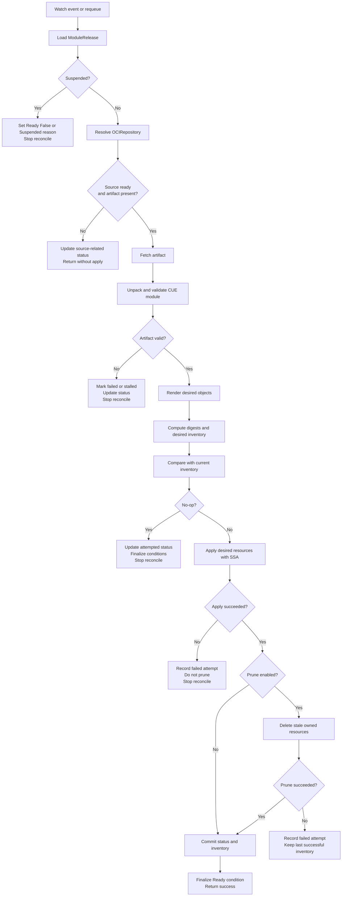
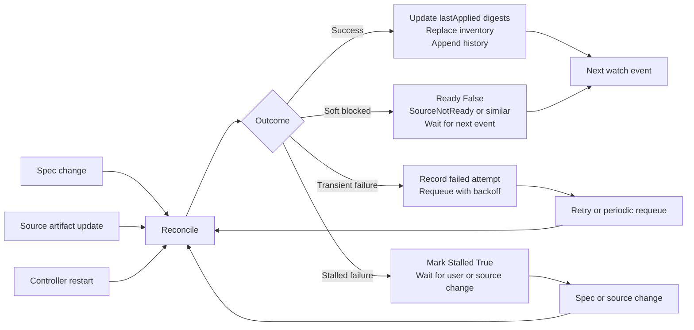

# ModuleRelease Reconcile Loop Design

## Summary

This document captures the initial detailed design of the `ModuleRelease` reconcile loop for the OPM proof-of-concept controller.

The goals of this design are:

- make the first controller implementation predictable and testable
- keep the reconcile loop aligned with the previously agreed `ModuleRelease` API and status model
- keep OPM CUE-native while using Flux `source-controller` for source acquisition
- keep server-side apply, prune, inventory, and status handling coherent

This is intentionally a v1alpha1-oriented design. It favors a simple and understandable flow over advanced rollback, health orchestration, or drift remediation.

## Scope

This document covers:

- reconcile triggers
- reconcile phases
- no-op behavior
- apply and prune ordering
- condition and status updates
- transient vs stalled failure handling
- bounded history behavior

This document does not finalize:

- full drift correction behavior
- bundle orchestration details
- full health/wait semantics after apply
- complex values composition from external sources

The initial design explicitly excludes release dependency orchestration. In particular, `ModuleRelease` v1alpha1 does not include `spec.dependsOn` or any dependency-gating behavior. Each `ModuleRelease` reconciles independently.

This design also follows the narrower proof-of-concept boundary described in `experimental-scope-and-non-goals.md`.

## High-level goals of reconcile

For each `ModuleRelease`, the reconcile loop should answer four questions reliably:

1. What source artifact should be used?
2. What desired Kubernetes resources does that source produce for the current spec?
3. What resources are currently owned by this release?
4. What status should be published about the result?

That leads to the following high-level controller contract:

- Flux resolves the source artifact.
- OPM fetches and validates module content.
- OPM renders desired resources from CUE.
- OPM applies desired resources with SSA.
- OPM prunes stale owned resources when enabled.
- OPM records digests, inventory, history, and conditions in status.

## Reconcile triggers

The initial controller should reconcile `ModuleRelease` when any of the following happen:

- the `ModuleRelease` object is created
- the `ModuleRelease.spec` changes
- the `ModuleRelease.metadata.generation` changes
- the referenced `OCIRepository` changes in a way that affects its resolved artifact
- the controller is restarted and cached state must be reconstructed
- periodic requeue occurs for retry or future drift-oriented behavior

The most important event sources are:

- `ModuleRelease`
- referenced `source.toolkit.fluxcd.io/v1 OCIRepository`

The controller should not rely on periodic polling alone when source-controller can already surface meaningful source updates.

## Design principles

### Source resolution is soft-blocking, not exceptional

If the referenced source is not ready yet, reconcile should usually not fail noisily. Instead, it should:

- set status to reflect that the source is not ready
- avoid moving into apply/prune phases
- return cleanly and wait for the next relevant event or retry

### Reconcile is deterministic from source plus config

For the same:

- source artifact digest
- normalized config values
- render inputs

the controller should produce the same desired resource set.

That lets the reconcile loop use:

- digests for no-op detection
- inventory for ownership only
- status for controller state

### Apply must succeed before prune runs

Prune must never run after a failed or partial apply phase in the same reconcile attempt.

The controller should only prune stale resources after:

- desired rendering succeeded
- desired apply succeeded

This avoids deleting previously working resources when the new desired state could not be safely established.

### Inventory reflects successful ownership only

`status.inventory` must represent the last successfully reconciled owned resource set.

It must not be replaced during a failed apply attempt.

### Status is the main operational ledger

The reconcile loop should treat CR `status` as the main operational ledger and should update:

- conditions
- source metadata
- last attempted digests
- last applied digests
- inventory
- bounded history

in a controlled and deterministic way.

## Finalized execution contract for v1alpha1

This section captures the current agreed execution contract for the initial `ModuleRelease` implementation.

### Included in v1alpha1

- source resolution through Flux `OCIRepository`
- source validation for the native CUE zip-layer contract
- artifact fetch and recovery
- CUE render of desired Kubernetes resources
- SSA apply of desired resources
- prune of stale previously owned resources when `spec.prune=true`
- ownership-only inventory in `status.inventory`
- digests, conditions, and bounded history in status
- no-op detection based on digests and ownership inventory

### Explicitly excluded from v1alpha1

- `spec.dependsOn`
- release dependency ordering or gating
- workload readiness as part of reconcile success
- automatic drift correction
- rich drift reporting UX
- rollback semantics
- multi-source support beyond `OCIRepository`
- values composition from Secrets, ConfigMaps, or layered files
- transactional behavior across multiple releases

### Success contract

A `ModuleRelease` reconcile attempt is considered successful when all of the following are true:

- the source resolves successfully and provides a usable artifact
- the artifact is fetched and validated successfully
- the module renders successfully
- desired resources are applied successfully with SSA
- if `spec.prune=true`, stale previously owned resources are pruned successfully
- status is updated to reflect the successful result

In v1alpha1, reconcile success means:

> rendered and applied successfully, with prune completed if requested

It does not yet mean:

- workloads are healthy
- workloads are available
- post-apply health gates have passed

### Failure contract

The reconcile loop distinguishes between:

- soft-blocked outcomes
- transient failures
- stalled failures

The controller must preserve the following invariants:

- prune never runs after failed apply
- `status.inventory` always reflects the last successful ownership set
- `lastAttempted*` may advance on failed attempts
- `lastApplied*` only advances after a fully successful reconcile

### Prune contract

If `spec.prune=true`:

- prune is part of the definition of successful reconciliation
- if apply succeeds but prune fails, the overall reconcile attempt is considered failed
- in that case `lastApplied*` MUST remain unchanged
- in that case `status.inventory` MUST remain the last successful ownership set

This protects the invariant that the recorded successful state represents a release that fully reached its requested end state.

## Outcome table

The reconcile loop should classify outcomes using the following model.

| Outcome | Meaning | Apply allowed | Prune allowed | Requeue behavior | Advances `lastApplied*` |
| --- | --- | --- | --- | --- | --- |
| `SoftBlocked` | The release cannot progress yet, but no real failure has occurred | No | No | Wait for source event or light retry | No |
| `NoOp` | Desired state matches the last successful state and no action is required | No | No | Normal watch-driven reconcile only | No |
| `Applied` | Desired resources were applied successfully and no prune was needed | Yes | No | Return success | Yes |
| `AppliedAndPruned` | Desired resources were applied successfully and stale resources were pruned successfully | Yes | Yes | Return success | Yes |
| `FailedTransient` | The attempt failed, but retrying later may succeed | Maybe, but did not finish successfully | No | Requeue with backoff | No |
| `FailedStalled` | The attempt failed in a way that likely requires spec/source change | No successful completion | No | Do not hot-retry; wait for change | No |

## Condition and reason matrix

The initial condition contract should be explicit and stable.

### Condition types

- `Ready`
- `Reconciling`
- `Stalled`
- `SourceReady`

### Reasons

- `Suspended`
- `SourceNotReady`
- `SourceUnavailable`
- `ArtifactFetchFailed`
- `ArtifactInvalid`
- `RenderFailed`
- `ApplyFailed`
- `PruneFailed`
- `ReconciliationSucceeded`

### Condition matrix by outcome

| Situation | `Ready` | `Reconciling` | `Stalled` | `SourceReady` | Primary reason |
| --- | --- | --- | --- | --- | --- |
| Suspended | `False` | `False` | `False` | unchanged or derived from source | `Suspended` |
| Source not ready | `False` | `False` | `False` | `False` | `SourceNotReady` |
| Active work in progress | `Unknown` or `False` | `True` | `False` | derived from source state | phase-specific |
| Successful reconcile | `True` | `False` | `False` | `True` | `ReconciliationSucceeded` |
| Transient failure | `False` | `False` | `False` | derived from source state | phase-specific failure |
| Stalled failure | `False` | `False` | `True` | derived from source state | phase-specific failure |

### Failure classification guidance

Use the following default classification rules:

- `SourceNotReady` -> soft-blocked
- invalid or missing source reference by policy -> stalled
- artifact fetch network or transport problem -> transient
- artifact content unsupported or invalid -> stalled
- CUE render failure from invalid user or module input -> stalled
- Kubernetes API timeout, conflict, or temporary failure -> transient
- apply validation or immutable-field failure without an enabled recovery policy -> stalled
- prune delete failure from temporary API issue -> transient
- prune failure from policy or ownership ambiguity -> stalled

## Attempted vs applied state contract

### `lastAttempted*`

`lastAttempted*` fields capture what the controller most recently tried to reconcile.

They should be updated when:

- source resolution succeeded enough to identify the source artifact
- rendering started or completed
- the reconcile attempt progressed far enough to represent a meaningful attempt

They may point to a failed reconcile attempt.

### `lastApplied*`

`lastApplied*` fields capture the most recent fully successful reconcile result.

They should be updated only when:

- apply succeeded
- prune succeeded if pruning was requested
- the inventory being committed is the new successful ownership set

### Inventory replacement rule

`status.inventory` should only be replaced after the reconcile attempt is fully successful.

If render fails, apply fails, or prune fails:

- the previous successful inventory remains authoritative

## No-op contract

The controller should recognize a no-op reconcile when all of the following are true:

- resolved source digest matches `lastAppliedSourceDigest`
- config digest matches `lastAppliedConfigDigest`
- render digest matches `lastAppliedRenderDigest`
- desired inventory digest matches the current successful inventory digest
- policy does not require an explicit mutation

When a no-op reconcile is detected, the controller should:

- update observed generation and any status fields that need to reflect fresh observation
- avoid rewriting inventory unnecessarily
- avoid appending noisy history by default
- leave `lastApplied*` unchanged

## Reconcile phases

The initial reconcile loop is divided into explicit phases.

### Phase 0: Load and preflight

Actions:

- fetch the `ModuleRelease`
- ignore if object is being deleted and there is no special finalization behavior yet
- exit early if `spec.suspend=true`
- create patching/status helpers
- initialize reconcile-local state

Outputs:

- object loaded
- `Reconciling=True` intent established

Failure class:

- API read failure is transient unless clearly permanent

### Phase 1: Resolve source

Actions:

- resolve the referenced `OCIRepository`
- validate that the ref can be read according to controller policy
- inspect source conditions and `status.artifact`
- read source revision, digest, and artifact URL

Outputs:

- resolved source metadata available in memory
- `status.source` candidate prepared

Success criteria:

- source object exists
- source is `Ready`
- source has a usable artifact reference
- source configuration preserves the native CUE zip payload expected by OPM

Soft-block case:

- source exists but is not yet ready

Failure cases:

- source reference invalid
- source object missing
- source artifact missing despite ready condition
- source uses an incompatible layer handling configuration for native CUE modules

### Phase 2: Fetch and unpack artifact

Actions:

- fetch the resolved artifact content
- recover the preserved native CUE payload into a local working directory
- validate the module content layout

Validation expectations in v1:

- artifact content can be recovered from the Flux-managed artifact handoff
- module root can be identified
- `cue.mod` exists where required
- any required release entrypoints are present according to the evolving artifact contract

Outputs:

- usable local module working directory

Failure cases:

- fetch failure
- copied payload cannot be recovered into a valid module tree
- unsupported artifact content format
- invalid module layout

### Phase 3: Render desired state

Actions:

- normalize inline input values
- evaluate the module using shared OPM/CUE helpers
- render desired Kubernetes objects
- build desired ownership inventory entries
- compute digests:
  - source digest
  - config digest
  - render digest
  - desired inventory digest

Outputs:

- rendered desired objects
- desired inventory entries
- digest set

Failure cases:

- invalid values
- invalid module content
- CUE evaluation failure
- conversion-to-Kubernetes-object failure

### Phase 4: Plan actions

Actions:

- compare desired inventory with current `status.inventory`
- compute stale set as:
  - previous owned resources minus current desired resources
- detect whether this reconcile is effectively a no-op
- prepare apply and prune plans

No-op determination should consider:

- `lastAppliedSourceDigest`
- `lastAppliedConfigDigest`
- `lastAppliedRenderDigest`
- current desired inventory digest
- whether there is any reason to believe live state needs mutation

Outputs:

- no-op / apply / prune decision
- stale set if pruning is enabled

### Phase 5: Apply desired resources

Actions:

- apply desired resources with server-side apply
- use the configured field manager
- use staged apply behavior where needed

Initial design decision:

- reconcile success in v1 means "rendered and applied successfully"
- it does not yet require full post-apply workload health orchestration

Outputs:

- desired resources successfully created or updated

Failure cases:

- SSA conflict or patch failure
- immutable field error not handled by chosen policy
- Kubernetes API validation failure

### Phase 6: Prune stale resources

Actions:

- if `spec.prune=true`, delete stale previously owned resources
- only delete resources proven to belong to the previous successful inventory of this release

Prune only runs when:

- render succeeded
- apply succeeded

Outputs:

- stale resources removed

Failure cases:

- delete failure
- authorization failure
- ownership ambiguity detected by policy

### Phase 7: Commit status

Actions:

- update `status.source`
- update `status.lastAttempted*`
- on success, update `status.lastApplied*`
- replace `status.inventory` with the new successful ownership set
- append a bounded history entry where appropriate
- finalize conditions

Outputs:

- status accurately reflects the outcome of the reconcile attempt

## Full flow diagram

## Reconcile loop and retry diagram

## Phase-by-phase status behavior

### Before source is ready

Recommended condition behavior:

- `Ready=False`
- `Reconciling=False`
- `Stalled=False`
- optional `SourceReady=False`

Recommended reason:

- `SourceNotReady`

This is not treated as a hard reconcile failure.

### During active work

Recommended condition behavior:

- `Reconciling=True`
- `Ready=Unknown` or `Ready=False` depending on finalizer strategy

Examples:

- resolving source
- fetching artifact
- rendering
- applying
- pruning

### On successful apply/prune completion

Recommended condition behavior:

- `Ready=True`
- `Reconciling=False`
- `Stalled=False`

Recommended reason:

- `ReconciliationSucceeded`

### On transient failure

Recommended condition behavior:

- `Ready=False`
- `Reconciling=False`
- `Stalled=False`

Examples:

- temporary fetch/network issue
- apiserver timeout
- temporary conflict or patch failure

Recommended reasons:

- `ArtifactFetchFailed`
- `ApplyFailed`
- `PruneFailed`

These should requeue with backoff.

### On stalled failure

Recommended condition behavior:

- `Ready=False`
- `Reconciling=False`
- `Stalled=True`

Examples:

- invalid source reference
- incompatible `OCIRepository.layerSelector` configuration
- artifact content is not a valid module
- CUE render fails because the desired config is invalid
- unsupported artifact layout

Recommended reasons:

- `InvalidSourceRef`
- `ArtifactInvalid`
- `RenderFailed`

These should generally wait for spec or source change rather than busy retries.

## Failure classification

The initial failure classification should be simple and explicit.

### Soft-blocked

Meaning:

- the controller is functioning correctly
- the release cannot progress yet because upstream source state is not ready

Examples:

- `OCIRepository` exists but is not ready
- source artifact has not yet been produced

Behavior:

- do not mark stalled
- do not try apply/prune
- publish clear status
- rely on source watch or periodic retry

### Transient failure

Meaning:

- the operation might succeed later without spec changes

Examples:

- temporary network failure
- temporary Kubernetes API failure
- temporary conflict in status patching or apply path

Behavior:

- record failed attempt
- do not replace last successful inventory
- requeue with backoff

### Stalled failure

Meaning:

- repeating the same reconcile without changing source or spec is not likely to help

Examples:

- invalid `sourceRef`
- artifact content is unsupported
- module validation fails
- render fails from invalid inputs

Behavior:

- mark stalled
- avoid hot retries
- wait for object or source change

## No-op behavior

The controller should recognize a no-op reconcile when:

- resolved source digest matches the last applied source digest
- config digest matches the last applied config digest
- render digest matches the last applied render digest
- desired inventory digest matches the current successful inventory digest
- no additional action is required by policy

In v1, a no-op reconcile should:

- update observed generation and source/status fields as needed
- not append noisy history on every no-op by default
- not rewrite inventory unnecessarily
- leave last applied digests unchanged

## Apply and prune ordering

The required ordering for v1 is:

1. render desired resources
2. apply desired resources
3. if apply succeeds and prune is enabled, prune stale resources
4. if both succeed, commit the new successful inventory

This ordering is mandatory because it protects against accidental destructive behavior during a failed rollout attempt.

## Inventory behavior during reconcile

The reconcile loop uses inventory in two different ways:

- current successful inventory from `status.inventory`
- newly computed desired inventory from the current render

The controller should:

- compute stale set from previous successful inventory vs current desired inventory
- use current desired inventory only for planning until apply and prune succeed
- replace `status.inventory` only after the reconcile attempt succeeds

This preserves the invariant that inventory reflects successful current ownership, not attempted ownership.

## History behavior

### What should be recorded

The initial history policy should record compact metadata entries for:

- successful apply
- successful prune when part of a reconcile
- failed fetch/render/apply/prune attempts

Each history entry should be metadata-only and should not contain full manifests.

### What should not be recorded

The initial history policy should avoid:

- recording every periodic no-op reconcile
- storing raw values
- storing full rendered object sets

### Suggested bounded retention

Suggested initial retention:

- keep the most recent 10 entries

That is enough for debugging and recent operational history without growing status endlessly.

## Waiting and health in v1

Initial design decision:

- reconcile success in v1 means "rendered and applied successfully"
- full workload readiness and health orchestration is not required for initial reconcile success

This keeps the first controller milestone focused on:

- source integration
- rendering
- SSA apply
- ownership inventory
- status correctness

Health-oriented readiness can be added in a later iteration.

## Suggested condition types and reasons

### Condition types

Recommended initial condition types:

- `Ready`
- `Reconciling`
- `Stalled`
- `SourceReady`

### Common reasons

Recommended initial reasons:

- `Suspended`
- `SourceNotReady`
- `SourceUnavailable`
- `ArtifactFetchFailed`
- `ArtifactInvalid`
- `RenderFailed`
- `ApplyFailed`
- `PruneFailed`
- `ReconciliationSucceeded`

These reasons are intentionally operational and phase-oriented rather than domain-heavy.

## Interaction with future drift handling

The initial reconcile loop is designed so drift features can be added later without changing the basic structure.

Future drift support can extend the `PlanActions` phase to:

- compare live objects to desired objects with SSA dry-run diff
- report drift in status
- optionally correct drift in a controlled policy mode

The initial v1alpha1 controller should not require automatic drift correction.

## Open questions

- Should source-not-ready always be a soft block, or are there cases where it should mark stalled immediately?
- Should some immutable field failures be handled with delete-and-recreate in v1, or deferred?
- Should no-op reconciles ever append history when the observed generation changes but rendered output does not?

## Current recommendation

The current recommended `ModuleRelease` reconcile loop is:

- source-aware
- deterministic
- apply-before-prune
- ownership-inventory-based
- status-ledger-driven
- no-op-aware
- simple about health and drift in v1

This is the right starting point for the POC because it preserves the most important OPM and Flux design goals while remaining small enough to implement and test cleanly.
